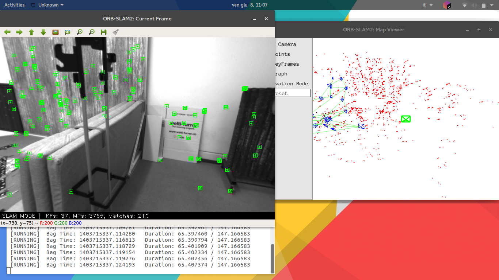
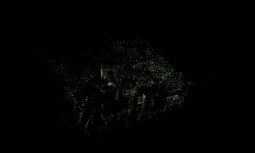

# Homework 3
#### Homework 3 per il Laboratorio Cyberfisico
Consegna:
>1. Installare il software ORB_SLAM2
>2. Procedere al processamento della rosbag V1_01_easy.bag contenuta nell’EuRoC MAV Dataset
>3. Modificare opportunamente il codice di ORB_SLAM2 in modo che venga salvata in un file .pcd la point cloud corrispondente alla ricostruzione dei punti 3D generata dall’algoritmo di SLAM. Assicurarsi che il file .pcd creato abbia un formato compatibile con la libreria PCL
>4. Eseguire ORB_SLAM2 modificato sulla rosbag V1_01_easy.bag generando così un file .pcd
>5. Utilizzare la libreria PCL per visualizzare in 3D la point cloud appena generata
>6. Clusterizzare i punti della point cloud in base alla distanza Euclidea utilizzando opportuni valori di soglia

## Come compilare ed eseguire
#### Come compilare
Recarsi nella cartella _ORB_SLAM2_ e digitare:

- `./build.sh`
- `export ROS_PACKAGE_PATH=${ROS_PACKAGE_PATH}:$(pwd)/Examples/ROS`
- `./build_ros.sh`

Recarsi poi nella cartella _Cluster Extraction_ e digitare:

- `cmake`
- `make`

#### Come eseguire
1. Aprire un terminale e lanciare `roscore`
2. Recarsi in _ORB_SLAM2_, aprire un altro terminale e lanciare `rosrun ORB_SLAM2 Stereo Vocabulary/ORBvoc.txt Examples/Stereo/EuRoC.yaml true`
3. Recarsi nella cartella dov'è collocata la bag V1_01_easy.bag, aprire un altro terminale e lanciare `export ROS_PACKAGE_PATH=${ROS_PACKAGE_PATH}:$(pwd)/Examples/ROS` e successivamente `rosbag play --pause V1_01_easy.bag /cam0/image_raw:=/camera/left/image_raw /cam1/image_raw:=/camera/right/image_raw`
4. Per far partire la bag, premere `[SPAZIO]` nell'ultimo terminale
5. Ad esecuzione conclusa, verrà creato un file nella cartella _ORB_SLAM2_ chiamato _pointcloud.pcd_
6. Per visualizzare questo file tramite la libreria PCL, posizionarsi nella cartella _ORB_SLAM2_ e lanciare in un terminale il comando `pcl_viewer pointcloud.pcd`
7. Per clusterizzarlo, spostare questo file all'interno della cartella _Cluster Extraction_ (poiché ho messo dentro al file _cluster_extraction.cpp_ il comando di andare a leggere il file _pointcloud.pcd_ direttamente nella cartella dov'è eseguito _cluster_extraction_) ed eseguire il comando `./cluster_extraction`
8. È possibile specificare il valore di soglia mettendolo come secondo parametro, in questo modo: `./cluster_extraction 0.35`
9. Se non dovesse essere specificato, il software userà il valore di default pari a `0.28`
10. Per visualizzare i punti clustati della point cloud con la libreria PCL, lanciare il comando ` pcl_viewer cloud_cluster_*` (dove l'asterisco serve per mandare al viewer tutti i file creati dal cluster_extraction)

## Svolgimento dell'homework
Ho modificato il file `/ORB_SLAM2/src/System.cc` aggiungendo a riga 475 una funzione che salva in un file i punti ottenuti da `GetAllMapPoints()`. Ho aggiunto dei commenti a quella porzione di codice fatta da me.
Per fare questo ho consultato [questa pagina](https://github.com/raulmur/ORB_SLAM2/issues/468 "GitHub.com").

Poi ho aggiunto al file `/ORB_SLAM2/include/System.h` nelle righe 119 e 120 la dichiarazione della funzione costruita in `System.cc`.

Ho modificato `/ORB_SLAM2/Examples/ROS/ORB_SLAM2/src/ros_stereo.cc` righe 128 e 129 per invocare la funzione da me creata passandogli come stringa "pointcloud.pcd", così da crearmi l'omonimo file.

Ho creato la cartella _Cluster Extraction_ e all'interno ho scritto il file `cluster_extraction.cpp` come suggerito dalla [documentazione](http://www.pointclouds.org/documentation/tutorials/cluster_extraction.php#the-code "PointClouds.org"). Ho modificato leggermente questo file nelle righe 77~81 per permettere di passare come secondo parametro il valore di soglia.

Ho creato il file `CMakeLists.txt` come suggerito dalla [documentazione](http://www.pointclouds.org/documentation/tutorials/cluster_extraction.php#compiling-and-running-the-program "PointClouds.org") e l'ho eseguito con `cmake` e quindi poi compilato con `make`.

## Screenshot

  
  
Esecuzione della Bag

  
  
2. Autonomous navigation in our map created in the previous point

